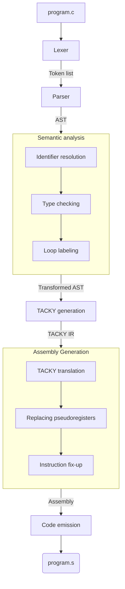
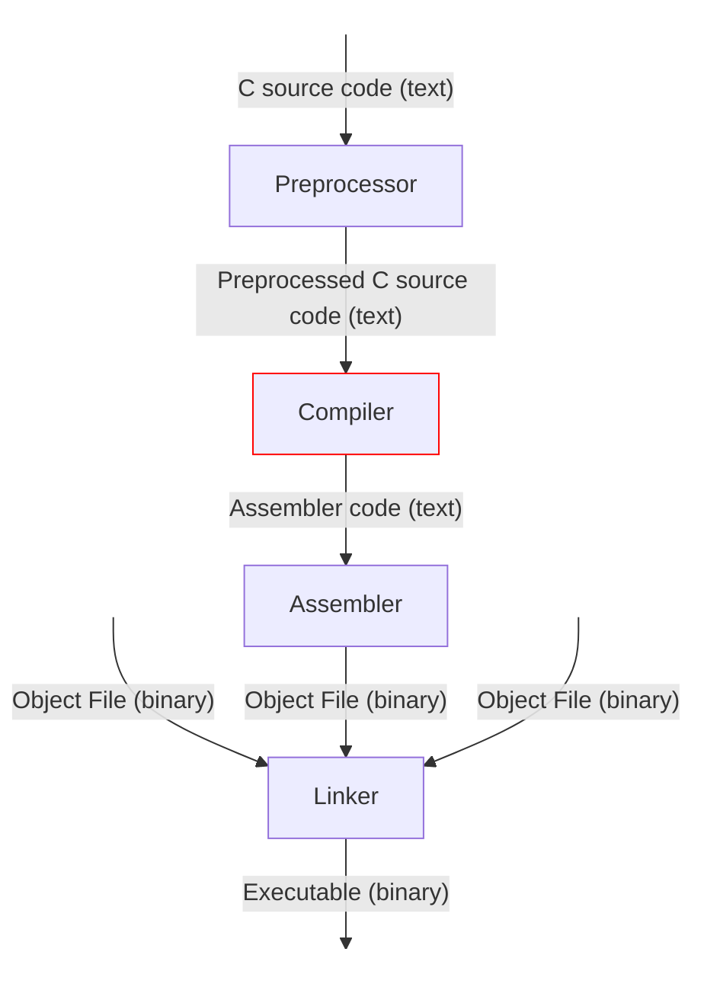

> [!WARNING]
> This project was built for learning and understanding.
> Expect experimentation and inefficiencies.

## About

Crust is a compiler for a subset of C, it is based on [Writing a C
Compiler](https://norasandler.com/book/) by Nora Sandler. For the time being,
crust relies on GCC for preprocessing, assembling, and linking in order
to produce a working executable.

This compiler targets the x86-64 System V ABI and produces executables that run
natively on Unix-like operating systems such as Linux and BSD, but not macOS.
Apple Silicon systems can emulate x64, Windows requires WSL.

**Features**

- Bare minimum: Can compile a main function that returns an integer into x64
  assembly.
- Arithmetic operators:
    - addition (`+`)
    - subtraction (`-`)
    - multiplication (`*`)
    - division (`/`)
    - remainder (`%`)
    - negation (`-`)
    - bitwise complement (`~`)
- Logical operators:
    - AND (`&&`)
    - OR (`||`)
    - NOT (`!`)
- Comparison operators:
     - equal to (`==`)
     - not equal to (`!=`)
     - less than (`<`)
     - greater than (`>`)
     - less than or equal to (`<=`)
     - greater than or equal to (`>=`)
- Variables: Supports variable declarations with (`int x = 5;`) or without
  initializer (`int x;`), validates variables exist before use and are limited
  to one declaration per scope.
- Conditionals: Supports `if ... else ...` statements and ternary expressions
  `... ? ... : ...`.
- Scopes: Create new scopes using blocks `{ ... }` in functions and as compound
  statements.
- Loops: Supports `for`, `while` and `do` loops.
- Functions: Supports function declarations, definitions and calls.
- ABI: Adheres to Sytem V x86 ABI, and can use functions defined in shared
  libraries
- ...more features in progress

## Getting started

Devshell available as `flake.nix`

Run `cargo build --release` to build project, executable will be found in
`target/release`. Run `crust --help` for information on usage.

Use `./run.sh` to run the sample hello world program.

## Architecture

### Context

Crust is a compiler, which is just one part of the complete process of
transforming source code into an executable program. Crust translates
preprocessed C source code into assembly code, while GCC handles the surrounding
stages, such as preprocessing, assembling and linking. The diagram below
illustrates the complete process and shows where Crust fits in. Crust also
serves as the compiler driver, coordinating and invoking each stage of the
compilation process in the correct order.

