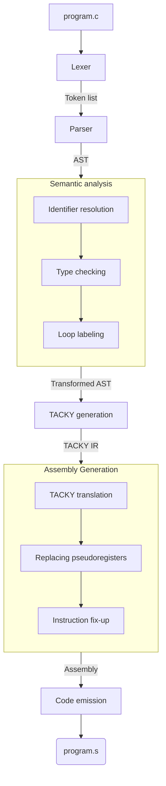

## About

Crust is a toy compiler for a subset of C written in Rust, based on [Writing a C
Compiler](https://norasandler.com/book/) by Nora Sandler.

For the time being, relies on GCC as compiler driver for invoking the
preprocessor, assembler and linker.

**Features**:

- Bare minimum: Can compile a main function that returns an integer into x64
  assembly.
- Arithmetic operators:
    - addition (`+`)
    - subtraction (`-`)
    - multiplication (`*`)
    - division (`/`)
    - remainder (`%`)
    - negation (`-`)
    - bitwise complement (`~`)
- Logical operators:
    - AND (`&&`)
    - OR (`||`)
    - NOT (`!`)
- Comparison operators:
     - equal to (`==`)
     - not equal to (`!=`)
     - less than (`<`)
     - greater than (`>`)
     - less than or equal to (`<=`)
     - greater than or equal to (`>=`)
- Variables: Supports variable declarations with (`int x = 5;`) or without
  initializer (`int x;`), validates variables exist before use and are limited
  to one declaration per scope.
- Conditionals: Supports `if ... else ...` statements and ternary expressions
  `... ? ... : ...`.
- Scopes: Create new scopes using blocks `{ ... }` in functions and as compound
  statements.
- Loops: Supports `for`, `while` and `do` loops.
- Functions: Supports function declarations, definitions and calls.
- ABI: Adheres to Sytem V x86 ABI, and can use functions defined in shared
  libraries
- ...more features in progress

## Architecture

## Getting started

Dependencies are managed using `flake.nix`.

Run `cargo build --release` to build project, executable will be found in
`target/release`. Run `crust --help` for information on usage.

Use `./run.sh` to run the sample program and automatically print its exit code.
