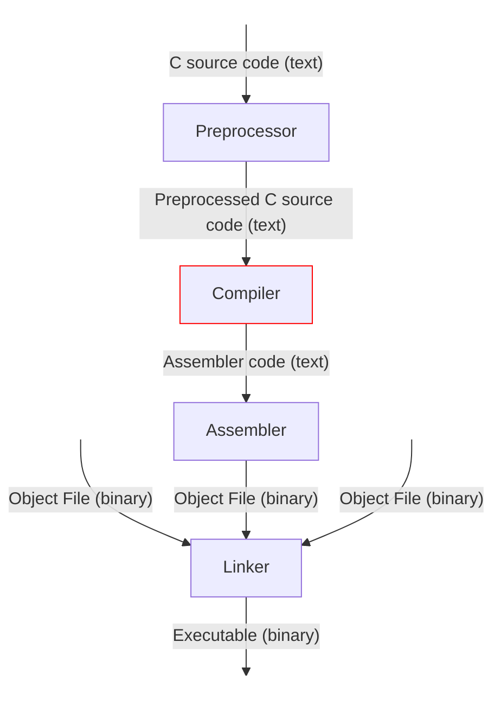
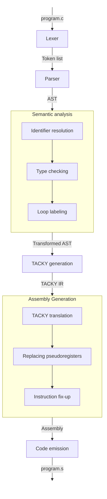

> [!WARNING]
> This project was built for learning and understanding.
> Expect experimentation and inefficiencies.

## About

Crust is a compiler for a subset of C, it is based on [Writing a C
Compiler](https://norasandler.com/book/) by Nora Sandler. For the time being,
crust relies on the GCC toolchain for preprocessing, assembling, and linking in
order to produce a working executable.

This compiler targets the x86-64 System V ABI and produces executables that run
natively on Unix-like operating systems such as Linux and BSD, but not macOS.
Apple Silicon systems can emulate x64, Windows requires WSL.

### Features

This compiler is still being developed, the current features are listed in the
table below.

| Feature              | Description                                                                                                                                                                |
| -------              | -----------                                                                                                                                                                |
| Variables            | Supports variable declarations with (`int x = 5;`) and without initializer (`int x;`)                                                                                      |
| Functions            | Supports function declaration, definition and calling. Variadic function can be run, but can not yet be compiled. Supports recursion.                                      |
| Scopes               | Supports scopes using blocks `{ ... }` in functions and as compound statements. Validates identifiers are declared before use and are limited to one definition per scope. |
| Types                | Supports `int` type.                                                                                                                                                       |
| Arithmetic operators | Supports addition (`+`), subtraction (`-`), multiplication (`*`), division (`/`), remainder (`%`), negation (`-`) and bitwise complement (`~`) operators .                 |
| Logical operators    | Supports AND (`&&`), OR (`\|\|`) and NOT (`!`) logical operators, these operators are short-circuit evaluated.                                                      |
| Comparison operators | Supports equal to (`==`), not equal to (`!=`), less than (`<`), greater than (`>`), less than or equal to (`<=`) and greater than or equal to (`>=`) operators.            |
| Loops                | Supports `for`, `while` and `do` loops.                                                                                                                                    |
| Conditionals         | Supports `if ... else ...` statements and ternary expressions `... ? ... : ...`.                                                                                           |
| Shared libraries     | Standard library functions can be called, `#include` directives are not supported yet, library functions need to be explicitly declared before use.                        |

## Getting started

A development shell is provided through `flake.nix`. Standard Rust tools are
required.

To build the project use `cargo build --release`, the executable will be found
in `target/release`. Run it with the `--help` flag for information
on usage.

To run a sample program, use the `./run.sh` script or compile and run the sample
program `program.c` yourself.

## Architecture

### Context

More specifically, Crust is a compiler and compiler driver. A compiler is one
part of the broader process of transforming source code into an executable
program. Crust translates preprocessed C source code into assembly, while the
GCC toolchain handles preprocessing, assembling, and linking.

As the compiler driver, Crust coordinates these stages and invokes the required
tools in the correct order. The diagram below shows the complete compilation
process and highlights where Crust fits in:

### Compiler Pipeline

The compiler pipeline is composed of several stages, with some stages containing
multiple passes. Each stage progressively transforms the source program into a
lower-level representation that more closely resembles assembly. More
information on each stage and pass can be found in the `Design` section. The
overall compilation pipeline is illustrated below:

