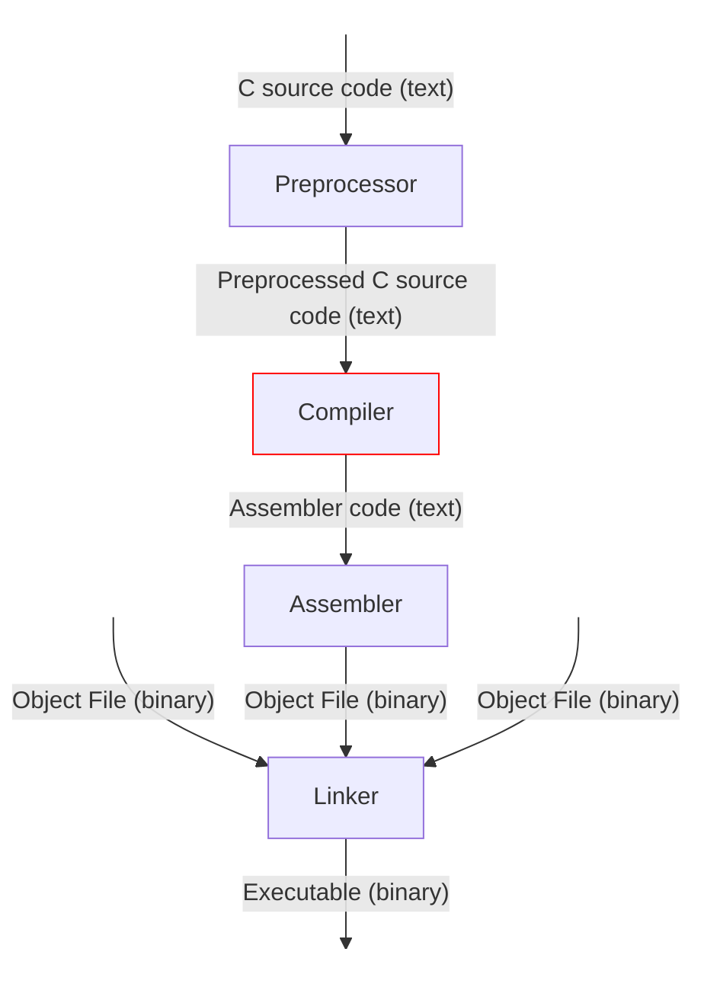
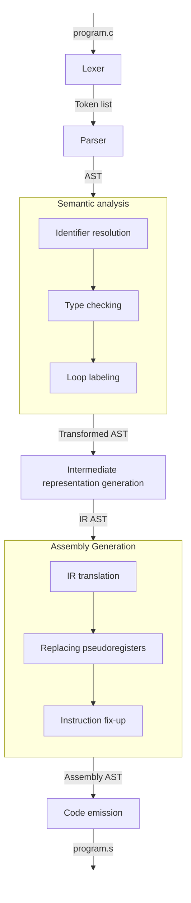

> [!WARNING]
> This project is built for learning and understanding purposes. Expect
> experimentation and inefficiencies.

## About

RPCC is a compiler for a subset of C, it is based on [Writing a C
Compiler](https://norasandler.com/book/) by Nora Sandler. For the time being,
RPCC relies on the GCC toolchain for preprocessing, assembling, and linking in
order to produce a working executable.

This compiler targets the x86-64 System V ABI and produces executables that run
natively on Unix-like operating systems such as Linux and BSD, but not macOS.
Apple Silicon systems can emulate x64, Windows requires WSL.

### Features

This compiler is still being developed, the current features are listed in the
table below.

| Feature              | Description                                                                                                                                                                |
| -------              | -----------                                                                                                                                                                |
| Variables            | Supports variable declarations with (`int x = 5;`) and without initializer (`int x;`)                                                                                      |
| Functions            | Supports function declaration, definition and calling. Variadic function can be run, but can not yet be compiled. Supports recursion.                                      |
| Scopes               | Supports scopes using blocks `{ ... }` in functions and as compound statements. Validates identifiers are declared before use and are limited to one definition per scope. |
| Types                | Supports `int` type.                                                                                                                                                       |
| Arithmetic operators | Supports addition (`+`), subtraction (`-`), multiplication (`*`), division (`/`), remainder (`%`), negation (`-`) and bitwise complement (`~`) operators .                 |
| Logical operators    | Supports AND (`&&`), OR (`\|\|`) and NOT (`!`) logical operators, these operators are short-circuit evaluated.                                                             |
| Comparison operators | Supports equal to (`==`), not equal to (`!=`), less than (`<`), greater than (`>`), less than or equal to (`<=`) and greater than or equal to (`>=`) operators.            |
| Loops                | Supports `for`, `while` and `do` loops with `break` and `continue` statements.                                                                                             |
| Conditionals         | Supports `if ... else ...` statements and ternary expressions `... ? ... : ...`.                                                                                           |
| Shared libraries     | Standard library functions can be called, `#include` directives are not supported yet, library functions need to be explicitly declared before use.                        |

<details>
<summary>Click to see an example program RPCC can compile</summary>

```c
int putchar(int c);

int factorial(int n) {
    if (n <= 1) {
        return 1;
    } else {
        return n * factorial(n - 1);
    }
}

int add(int a, int b) {
    return a + b;
}

int main(void) {
    int x = 5;
    int y;

    y = 3;

    int sum = add(x, y); // 8
    int diff = x - y;
    int prod = x * y;
    int quot = x / y;
    int rem = x % y;
    int neg = -x;
    int bit = ~x;

    int bigger = (x > y) ? x : y;
    int ok = (x == 5 && y == 3) || !(x != 5);

    {
        int x = 10;
        int inner = x + 1;
        sum = sum + inner; // 19
    }

    int i = 0;
    while (i < 3) {
        sum = sum + i;
        i = i + 1;
    } // sum = 22

    for (i = 0; i < 3; i = i + 1) {
        diff = diff + i;
    }

    do {
        prod = prod - 1;
    } while (prod > 0);

    i = 0;
    while (1) {
        i = i + 1;
        if (i == 2) continue;
        if (i == 5) break;
        prod = prod + i;
    }

    if (ok) {
        sum = sum + factorial(4); // 46
    } else {
        sum = sum - 1;
    }

    putchar(104); // h
    putchar(101); // e
    putchar(108); // l
    putchar(108); // l
    putchar(111); // o
    putchar(10);  // newline

    return sum; // 46
}
```

</details>

## Getting started

A development shell is provided through `flake.nix`. Standard Rust tools are
required.

To build the project use `cargo build --release`, the executable will be found
in `target/release`. Run it with the `--help` flag for information
on usage.

To run a sample program, use the `./run.sh` script or compile and run the sample
program `program.c` yourself.

## Architecture

### Context

More specifically, RPCC is a compiler and compiler driver. A compiler is one
part of the broader process of transforming source code into an executable
program. RPCC translates preprocessed C source code into assembly, while the
GCC toolchain handles preprocessing, assembling, and linking.

As the compiler driver, RPCC coordinates these stages and invokes the required
tools in the correct order. The diagram below shows the complete compilation
process and highlights where RPCC fits in:



### Compiler Pipeline

The compiler pipeline is composed of several stages, with some stages containing
multiple passes. Each stage progressively transforms the source program into a
lower-level representation that more closely resembles assembly. Information on
implementation details of each stage and pass can be found in the `Design`
section. The overall compilation pipeline is illustrated below:



- **Lexer**: The lexer reads in a source file and produces a list of tokens.
  Tokens are the smallest meaningful units of the language, such as keywords,
  brackets, identifiers etc. These are predefined and described in the language
  specification.
- **Parser**: The parser groups these tokens into language constructs. Because
  these constructs are hierarchical: each language construct is composed of
  simpler constructs, the output is put into a tree data structure called an
  abstract syntax tree (AST).
- **Semantic Analysis**: During semantic analysis, the AST is traversed and the
  program is semantically verified. It detects errors the parser can't. For
  example a program can be syntactically correct, but semantically invalid. A
  program can assign a value to an expression that isn't assignable like `int 2
  = 3` or use a variable before it's been declared. It consists of the following
  passes.
    - **Identifier Resolution**: The identifier resolution pass resolves
      references of identifiers to their declarations and reports and verifies
      that an identifier is declared only once and not used before being
      declared (except if the identifiers have some form of linkage).
    - **Type Checking**: The type checking pass verifies that declarations and
      uses of identifiers have compatible types. This includes verifying that
      function definitions, declarations, and calls have the same number and
      types of parameters.
    - **Loop Labeling**: During the loop labeling pass, each break and continue
      statement is checked to ensure it appears within a loop and is associated
      with the loop it (implicitly) refers too.
- **IR generation**: During intermediate representation (IR) generation the AST
  is transformed into an IR AST. C and assembly programs have fundamentally
  different structures. For example, assembly does not support nested
  expressions. Introducing an intermediate representation allows these
  structural differences to be handled in a separate compiler pass, rather than
  in one large, complicated assembly pass. It also provides a common starting
  point for generating code for different assembly languages, with optimizations
  performed on the IR benefiting every target generated from it.
- **Assembly generation**: During the assembly generation stage, the IR AST is
  translated into an assembly AST through the following passes.
    - **IR Translation**: Each IR instruction is translated into one or more
      assembly instructions. At this stage, however, temporary variables have
      not yet been assigned concrete memory addresses.
    - **Replacing Pseudoregisters**: During this pass, that issue will be
      resolved and temporary variables will be assigned concrete addresses.
    - **Instruction Fix-up**: During this pass, some changes will be made to the
      generated assembly instructions to make sure the program is correct. For
      example, many x64 instructions do not allow both operands to refer to
      memory locations. When this occurs, one operand is moved into a temporary
      register.
- **Code emission**: During the final stage, the AST is traversed one last time,
  and its contents are written to a file.

## Design

### Lexer

Tokens are defined using regular expressions. When reading the input file, the
lexer finds the longest match out of these regexes to determine the next token.
If it doesn't find a match, the lexer will error, otherwise it will remove the
match from the file and goes on to find the next token.

### Parser

The create the AST a predictive parser is used, which is a recursive descent
parser that looks ahead a few tokens to figure out which language construct it
needs to parse. A recursive descent parser is built from mutually recursive
functions that each are responsible for parsing a language construct.

### Semantic Analysis

#### Identifier Resolution

To resolve identifiers, the AST is traversed in same manner as it gets build,
with mutually recursive functions for each language construct. During this
traversal, a map is maintained that maps each identifier declaration to a
generated unique (resolved) name. Variables and function parameters are assigned
generated names, while function names retain their original names. If the same
identifier is declared twice in the same scope, this pass will fail with a
`duplicate declaration` error.

When an expression uses an identifier, the identifier is looked up in the map
and replaced with its resolved name. If no entry is found, this pass fails with
an `undeclared variable` or `undeclared function` error. Function calls are resolved
in the same way, but function declarations are kept under their original names
so that calls continue to refer to those names.

When entering a new scope, the identifier map is copied. Declarations made in
the new scope can shadow declarations from outer scopes, while duplicate
declarations within the same scope are rejected. When the scope is exited, the
copied map is discarded and the outer map is used again. Function parameters and
the function body are resolved using a new scope, and function declarations
inside another scope may not contain a body; attempting to define such a
function causes the pass to fail.

This means that later passes do not need to track variable scope explicitly,
since variables with the same user-defined name receive different generated
names when they are declared in different scopes. Function names are an
exception because they retain their original names.

Generated variable names follow the format `<variable_name>.<count>`. Each time
a new identifier is added to the map, the counter is incremented. When a
generated name is created, the current counter value is appended to the original
variable name.

#### Type Checking

To type check the program, the AST is traversed and a symbol table is maintained
that maps each identifier to its type. Variables and function parameters are
assigned the `Int` type, while functions are assigned a `FunType` containing the
number of parameters they accept.

When a function declaration is encountered, its name and parameter count are
stored in the symbol table. If the function was previously declared with a
different number of parameters, this pass fails with an `incompatible function
declaration` error. A function may be declared more than once, but defining the
same function more than once causes the pass to fail with a `duplicate function
definition` error.

When an expression uses an identifier, the identifier is looked up in the symbol
table and its type is checked. If a variable is used as a function name, or a
function name is used as a variable, this pass fails with a `incomptaible type`
error. Function calls are checked to ensure that the referenced identifier is a
function and that the number of provided arguments matches the function’s
declared parameter count.

#### Loop Labeling

To label loops, the AST is traversed and the loop label generator maintains a
counter that is used to create a unique label for each loop. The generated
labels follow the format `loop.<count>`, and the counter is incremented each
time a new loop is encountered.

This pass transforms the AST nodes into their labeled counterpart nodes. When a
loop is encountered, a new label is generated and stored in the labeled node.
The loop body is then recursively traversed with this label as the `current
label`. Nested loops generate their own labels, which replace the `current
label` while their bodies are being processed. When a break or continue
statement is encountered, it is replaced with a labeled version that refers to
the `current label`. If either statement appears outside of a loop, this pass
fails

### Intermediate Representation Generation

The intermediate representation in this project is similar to [Three-address
code](https://en.wikipedia.org/wiki/Three-address_code). Temporary variable are
named as follows `tmp.<count>`. Jump labels are generated using
`<jump_label_type><count>`, for instance `and_end1`

### Assembly Generation

#### IR Translation

This pass recursively descends through the IR AST and translates each node into
the corresponding assembly instructions. Some IR nodes are directly mapped to
assembly instructions, more complex nodes can require multiple instructions.

#### Replacing Pseudoregisters

This pass walks the assembly IR and rewrites each instruction operand by
operand, replacing every pseudoregister with a stack address. It keeps an map of
known identifiers to offsets for all later references. Every function keeps
track of its own stack size.

#### Instruction Fix-up

The final assembly generation pass walks the AST and fixes up all instructions
that need it. It starts off by inserting an `AllocateStack` instruction for
every function and pads the function stack size to the next multiple of 16. Then
it makes sure that:

- Move instructions don't have memory addresses for both its source and
  destination
- Add and Sub instructions don't operate on two memory addresses
- The idiv instruction doesn't operate on immediate values
- The imul instruction doesn't use a memory address as its destination
- Cmp instruction don't use memory address for both operands
- The right operand of cmp isn't constant

It does this by storing memory address in temporary registers and then rewriting
the instructions to use those registers.

### Code Emission

During code emission a buffer is created, and while this stage walks the AST, it
appends assembly instructions based on the node its processing. Finally this
buffer is written to a file.

It uses no underscores for labels, and prefixes local labels with `.L`. For
functions call to external libraries it appends `@PLT` to the function
identifier. At the start of a function node it inserts a function prologue and a
function epilogue for return nodes. This pass also appends `.section
.note.GNU-stack,"",@progbits` to the end of the file to indicate it doesn't need
an executable stack.

## Dependencies

One of the project goals is to be written completely from scratch. For now it
relies on the [regex](https://docs.rs/regex/latest/regex/) crate and a handful
of Rust standard-library modules to be build:
- `std::collections::HashMap`
- `std::env`
- `std::fs`
- `std::process`
- `std::sync::LazyLock`

To run the project `gcc` is required.

## Testing

This project uses the [Writing a C Compiler Test
Suite](https://github.com/nlsandler/writing-a-c-compiler-tests.git) supplied by
Nora Sandler.
